# godot-custom-icons
Custom node icons for Godot. 

If you make any icons of your own, derived from these or not, we strongly encourage you to try to contribute to the repo! 

You can create a pull request by simply putting your icons into the correct categories, and if they fit the themeing of the existing godot icons well enough, they may be added to the repo. 

This is a casual informal repo, so there is no official style guide or anything you are required to follow, simply keeping things with the existing look and feel for the Godot Engine. 

## Icon Previews:

AI

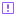 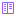 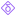  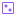   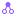 

Control

There are currently no icons in this category. Feel free to commit your own!

Generic

   

Node2D

There are currently no icons in this category. Feel free to commit your own!

Node3D

  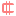  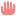 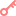   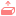 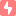 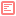 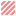 

